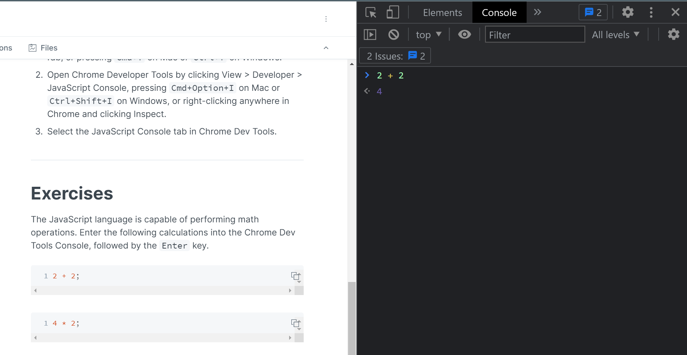

# 2.1: Operations

## Learning Objectives

- Use mathematical _**operators**_ to perform mathematical _**operations**_ in the console of your browser

## Introduction



Coding means writing instructions for the computer to execute. We will begin with the most basic instructions the computer can execute, which is operations between 2 number values.

## \*\*\*\*

## **Setup**

1. Open a new tab in the Chrome browser by clicking File > New Tab, or pressing `Cmd+T` on Mac or `Ctrl+T` on Windows.
2. Open Chrome Developer Tools by clicking View > Developer > JavaScript Console, pressing `Cmd+Option+I` on Mac or `Ctrl+Shift+I` on Windows, or right-clicking anywhere in Chrome and clicking Inspect.
3. Select the `Console` tab in Chrome Dev Tools.



You can use `Ctrl + L` or `Cmd + K` to clear your console


## Exercises

The JavaScript language is capable of performing math operations. Enter the following calculations into the Chrome Dev Tools Console, followed by the `Enter` key.



```javascript
2 + 2;
```

```javascript
4 * 2;
```

```javascript
4 / 2;
```

```javascript
4 - 2;
```

The input here is a mathematical equation typed in by the user, you. You have _instructed_ the computer to perform a mathematical operation. The computer \_**returned** \_ an output, the evaluation of the equation.


These exercises may seem trivial, but mathematical operations are at the core of all computing instructions. Computers fundamentally _**compute.**_ That being said, they can get things predictably wrong. Try: `0.1 + 0.2` in your console. Did you get what you expect?

Coding Fundamentals will not cover why computers sometimes behave in odd ways, but you can read up more about this particular behaviour [here](https://0.30000000000000004.com) and [here](https://betterprogramming.pub/why-is-0-1-0-2-not-equal-to-0-3-in-most-programming-languages-99432310d476).


### Operators

In the above code, `+` `*` `-` and `/` are known as _operators._ Specifically, they are mathematical operators, as they perform a mathematical operation on 2 numbers. One other mathematical operator is the remainder operator, sometimes known as the modulus operator, defined with the `%` symbol. It returns the remainder after one number is divided by another; 10 `%` 3 will give us 1 because dividing 10 by 3 will result in a remainder of 1.


This course will only involve basic math: adding and subtracting (usually by 1), dividing and multiplying, and comparing numbers.


We will soon see other kinds of programming operators and operations; in the next section, we will see the _assignment operator._
