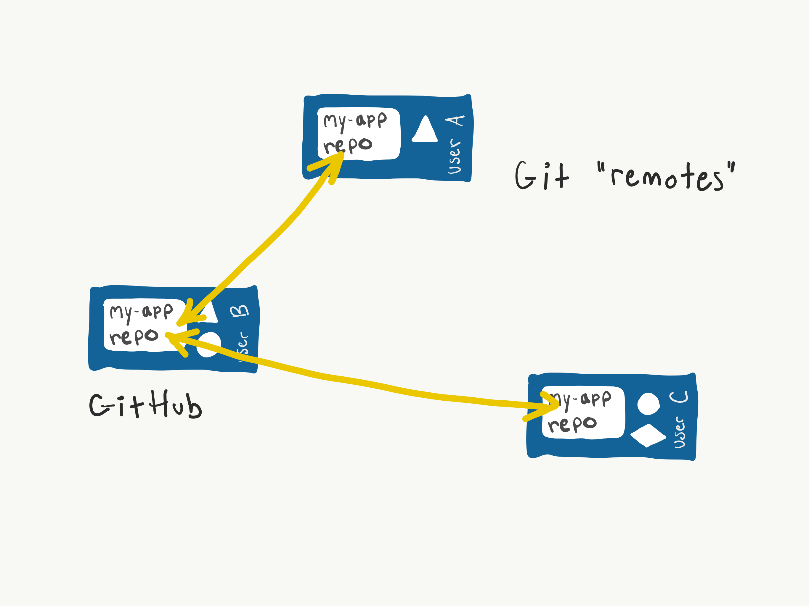

# 8.1: Intro to GitHub

## Learning Objectives

At the end of this lesson, you should:

* Be _familiar_ with GitHub
* Understand briefly how GitHub extends the capabilities of Git

## Introduction



GitHub is a web application that hosts Git repositories on the internet. It is a centralised set of repositories developers use to hold "official" copies of their code.

### Why Use GitHub?

In Basics we'll be using GitHub as a place to download starter code, and, when we cover [8.2](8.2-github-fork-and-clone.md) (GitHub Fork and Clone) we'll use it to submit projects and store our code and code versions online.

Don't worry for now if the structure of local and remote repositories seems confusing, we'll be covering these topics again more in-depth in [8.2](8.2-github-fork-and-clone.md) and [8.3](8.4-github-repo-browsing.md).

