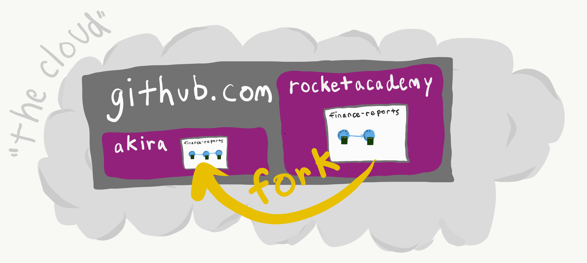

# 8.2: GitHub Fork and Clone

## Learning Objectives

At the end of this lesson, you should:

- Be able to use the GitHub Fork feature.
- Be able to use the `git clone` command.
- Be able to use the `git push` command.

## Introduction

We will learn more features of Git and GitHub to start and submit Coding Basics projects. As a reminder, Git is the _version control system_ and GitHub is the code-hosting website built on top of Git. GitHub extends the capabilities of Git by adding visual code browsing, social features, and collaboration features.


In the below video we demonstrate `git push origin master`, but for Coding Basics `git push` will suffice. `origin` refers to the target Git remote, and `master` refers to the target branch. **Rocket Academy has updated our repos to use `main` as the default branch** name as per GitHub's latest convention, so if you wanted to specify the full command including remote and branch for Basics, you could use **`git push origin main`**.




### GitHub Fork

"Fork" is the GitHub term for _copying_ a repo from one GitHub account to another. We can fork a repo by clicking the Fork button on a given GitHub repo page. Forking allows us to make changes to a repo and save those changes to _our own_ GitHub account's copy of the repo. Our account's repo is essentially _**independent**_ from the original, forked repo.

 (2) (3) (1) (2).png>)

"Fork" is a GitHub concept. Forking is not built-in to the Git version control system.



## Git Clone

We'll use a Git command to download or "clone" a copy of Coding Basics starter code. `<REPO_DOWNLOAD_URL>` is the download URL of our repo, obtained by clicking the Download Code button on the repo's [GitHub page](https://github.com/rocketacademy/fundamentals-starter-code). `<LOCAL_REPO_FOLDER_NAME>` is the name of the destination folder that is created (containing the contents of the repo) when we run the Git command.

**Command Template**

```
git clone <REPO_DOWNLOAD_URL> <LOCAL_REPO_FOLDER_NAME>
```

**Sample Command**

```
git clone https://github.com/rocketacademy/fundamentals-starter-code.git fundamentals-starter-code-test
```


GitHub enables us to coordinate differences between local and "official" versions of the code, but we won't concern ourselves with that just yet.

### Git Push

We will learn 1 new Git command `push` to send local code commits from our computers to GitHub. `push` can also be used as a general command to move code between "remote" repos, but during Coding Basics we will only be using `push` to push code to GitHub.

.png>)

## Cheatsheet

Here is the workflow for Coding Basics projects:

1. Go to the project repo page. Click the "Fork" button to copy the repo to our own GitHub account.
2. In the command line on our local computer, **clone the repo from our own Github account's copy of the repo.**
3. Once the repo is on our computer, make the changes we want, and follow the Git workflow and [cheatsheet ](../7-version-control/7.1-git.md#cheat-sheet)to commit those changes.
4. `git push` our changes to our repo. **Refresh** the repo page to see our commits in the repo.
5. Create a [pull request](8.3-github-pull-request.md) in GitHub. This connects our work on the repo _in our account_ to the original Rocket Academy repo. Fill in the survey and submit.

## Exercise

1. Fork a copy of the [Basics _Beat That_! repo](https://github.com/rocketacademy/basics-beat-that) as setup for Project 2.
2. Clone the repo into a folder on your local machine.
3. Once you start working on your project, make frequent commits and use `git push` to update your GitHub repo.
